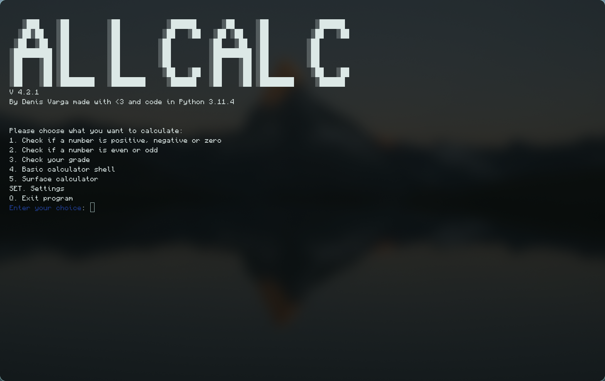

# ALLCALC

```text
   ░███    ░██         ░██           ░██████     ░███     ░██           ░██████  
  ░██░██   ░██         ░██          ░██   ░██   ░██ ░██   ░██          ░██   ░██ 
 ░██  ░██  ░██         ░██         ░██         ░██   ░██  ░██         ░██        
░█████████ ░██         ░██         ░██         ░█████████ ░██         ░██        
░██    ░██ ░██         ░██         ░██         ░██    ░██ ░██         ░██        
░██    ░██ ░██         ░██          ░██   ░██  ░██    ░██ ░██          ░██   ░██ 
░██    ░██ ░██████████ ░██████████   ░██████   ░██    ░██ ░██████████   ░██████  
```

**Version 4.2.3**

[](https://pypi.org/project/allcalc/)
[](https://www.python.org/)
[](LICENSE)
[](https://github.com/DenisVargaeu/allcalc/issues)
### Modular Python calculator, fully CLI, lightweight, and fast.

## Modules

* Basic Calculator Shell | /modules/basiccalc.py
* Even or odd number chceker | /modules/evenodd.py
* Grade chcker | /modules/grade.py
* Negative number checker | /modules/negativecheck.py
* Surface calculator| /modules/surface.py

## Features

* I18n localiztion
* modular system 
* easy to read code
* setting to edit language and more features coming soon
* config file to store config for now jut language 
* auto ascii for small screnn


## Languages 
* sk - slovak
* en - English
* de - Deutch

## How to install and run ? 
### instalation
### 1.option via pip
```bash
pip install allcalc
```
Or 
```bash
python -m pip install allcalc
```
on linux 
```bash
pip install allcalc --break-system-packages
```
## Run

```bash
allcalc
```


(if python modules arent in path use )
```bash
python -m allcalc
```
## gallery 

### Main menu


#### And like this you good to go
##### Feel free to contribute 
###  made with code and <3 by Denis Varga
